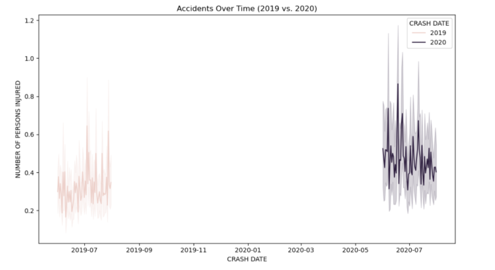
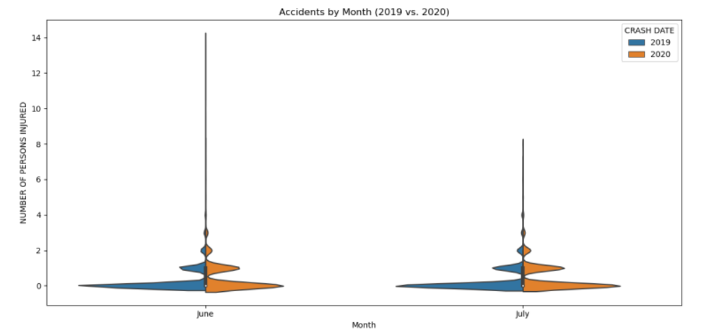
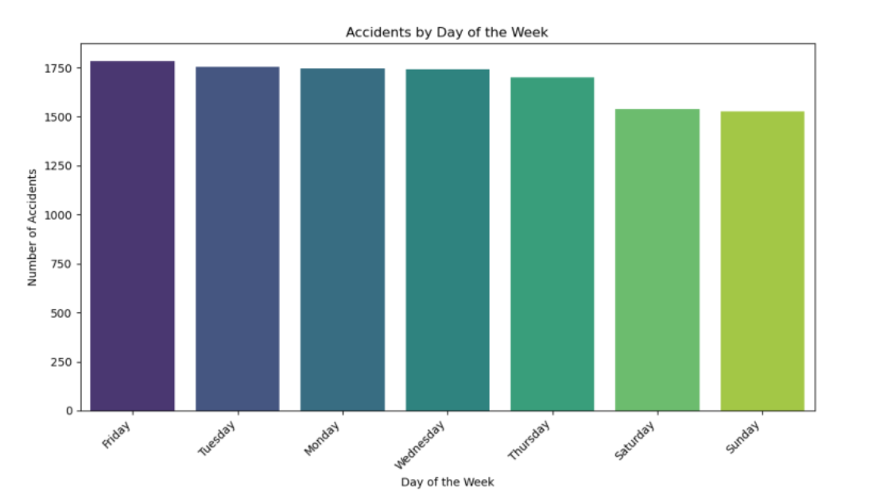
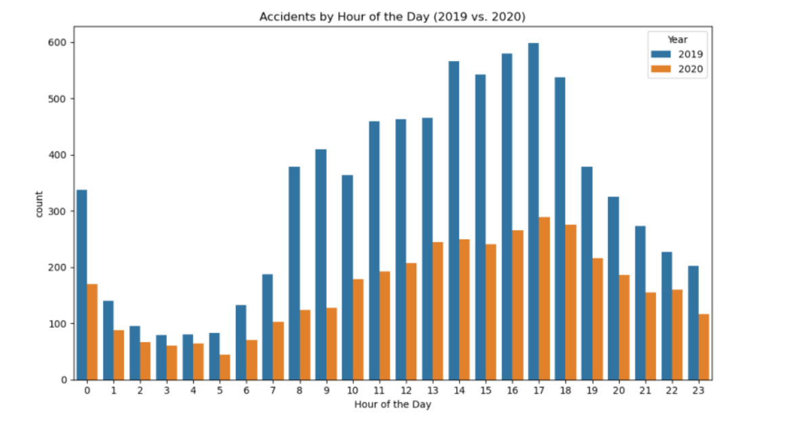
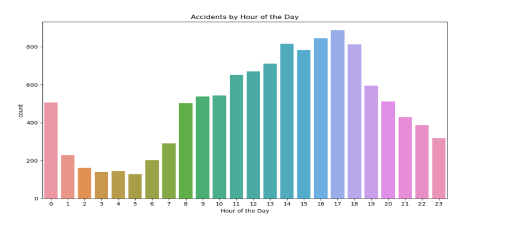
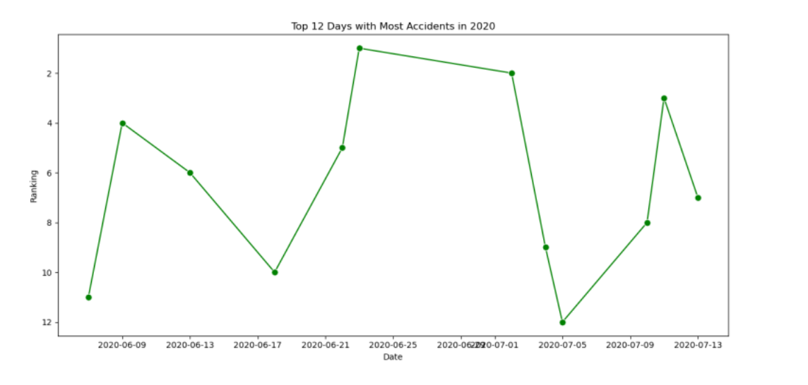
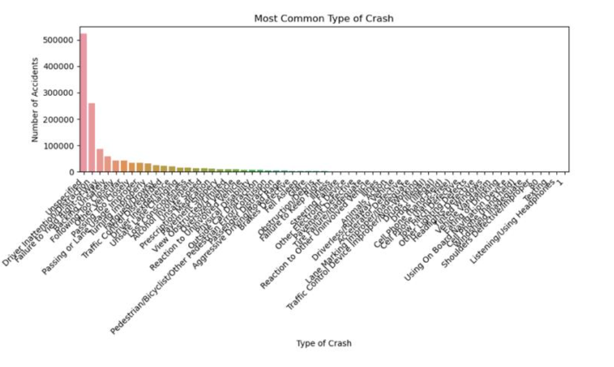
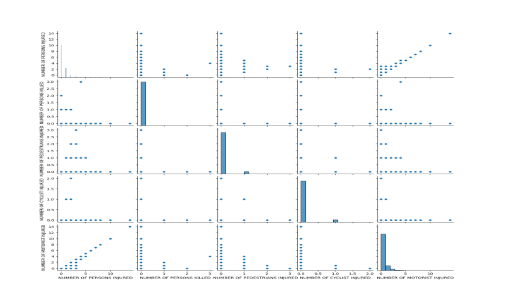
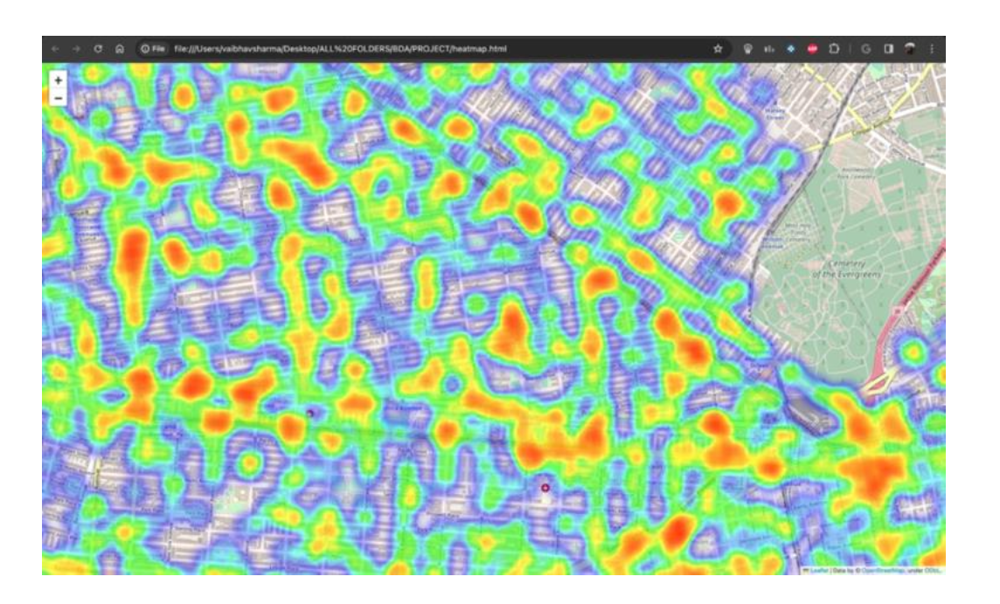
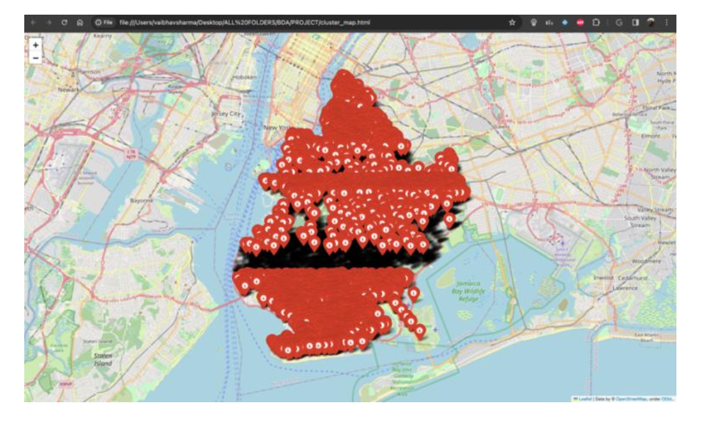

# NYC Accident Analysis

## Section I - Data Preparation Discussion

- **How clean is the data?**
    - The data cleaning process involves dropping rows with missing values in critical columns such as 'CRASH DATE,' 'BOROUGH,' 'NUMBER OF PERSONS INJURED,' 'LATITUDE,' and 'LONGITUDE.'
    - The 'CRASH DATE' column is converted to datetime format.
    - The 'NUMBER OF PERSONS INJURED' column is converted to an integer type.
    - The code also takes measures to handle missing values and convert data types, contributing to data cleanliness.

- **Which data did you ignore?**
    - We ignored rows with missing values in the specified critical columns during data cleaning.
    - It focuses on a specific borough (Brooklyn) and selected months and years for analysis, potentially ignoring data outside these criteria.

- **What data did you focus on?**
    - Our code focuses on traffic-related data for a specific borough (Brooklyn) during the months of June and July for the years 2019 and 2020.
    - The analysis includes various aspects such as geographical distribution, accidents over time, accidents by day of the week, accidents by hour of the day, and monthly comparisons.

- **Did you quantize the data into regions?**
    - We create a GeoDataFrame using the 'LATITUDE' and 'LONGITUDE' columns, allowing for better geographical handling.
    - It utilizes a heatmap using Folium to visualize the density of accidents, providing a sense of quantization into regions based on the geographical distribution.

- **Are there any issues with the data?**
    - In reviewing the NYPD Motor Vehicle Collisions dataset, we have identified a few potential issues that warrant consideration. First, there were missing values in critical columns such as 'CRASH DATE,' 'BOROUGH,' 'NUMBER OF PERSONS INJURED,' 'LATITUDE,' and 'LONGITUDE.' To address this, we opted to drop rows with missing values in these key fields, ensuring the integrity of our analysis.

- **Is the data from the two years comparable?**
    - Yes, it is comparable:
        - We compared data for the years 2019 and 2020, focusing on specific months (June and July).
        - The comparison is done through various visualizations, including line plots, bar plots, and statistical analysis of differences.

## Section II - Answers to the Questions

As you answer them, describe the process you used. Use data visualizations (probably heat maps or contour maps). Possible questions to consider: What clustering did you do? What processing did you do? What algorithms did you use? Did you need to normalize your data somehow? How did you do any data visualization or create figures?

- In our analysis, we began by loading the traffic-related data from the CSV file into a pandas DataFrame, paying special attention to the 'ZIP CODE' column by explicitly specifying its data type as a string. This ensured accurate representation of ZIP codes.

- **Data Cleaning and Preprocessing:**
    - We focused on critical columns, including 'CRASH DATE,' 'BOROUGH,' 'NUMBER OF PERSONS INJURED,' 'LATITUDE,' and 'LONGITUDE.' Rows with missing values in these columns were dropped to ensure data integrity.
    - We converted the 'CRASH DATE' column to datetime format to facilitate temporal analysis. Additionally, the 'NUMBER OF PERSONS INJURED' column was cast to an integer type for numerical consistency.

- **Geospatial Data Handling:**
    - To enhance geographical handling, we transformed the DataFrame into a GeoDataFrame using the 'LATITUDE' and 'LONGITUDE' columns. This allowed us to leverage geopandas functionalities for better spatial analysis.

- **Interactive Geographical Visualization:**
    - We created an interactive Folium map centered around the median coordinates of accidents in Brooklyn. The map included a heatmap layer, generated using the HeatMap plugin, to visualize the density of accidents across different regions. This provided a dynamic and intuitive representation of accident hotspots.

- **Temporal Analysis:**
    - For temporal analysis, we utilized line plots and bar plots to explore patterns over time. We specifically focused on the total number of persons affected, aggregating various injury and fatality columns. This allowed us to compare the trends between 2019 and 2020, highlighting any significant changes.

- **Reflections on the Data:**
    - In examining the traffic data, we observed a decline in the number of persons injured during the summer months of 2020 compared to 2019. Visualization revealed notable patterns, with a focus on the top 100 consecutive days showcasing the highest accident frequency.
    - Temporal metrics unveiled September 12th as the most common day for accidents, and the 13th as the most common date. Additionally, the top 10 worst days of the year were identified based on persons injured.
    - Regarding specific concerns, instances of accidents involving Amazon trucks were present in the dataset, suggesting a potential issue in this regard.

Find the answers to the following seven questions:

1. **For the two years given, figure out what has changed in the summer from one year to the next. Figure out how to visualize the difference, in some way.**
    
    Graph 1: Accidents Over the Considered Duration

2. **How was June of 2019 different then June of 2020? Figure out how to show or demonstrate the difference.**

    Difference in June 2019 and June 2020: -337 (there were 337 fewer persons injured in June 2020 compared to June 2019)
    
    Graph 2: Differences in Accidents by Month of June 19 vs June 20 and July 19 vs July 20

3. **How was July of 2019 different then July of 2020? Figure out how to show or demonstrate the difference.**

    Difference in July 2019 and July 2020: -311 (there were 311 fewer persons injured in July 2020 compared to July 2019) See Graph 2 for seeing visualization of difference between July 2019 and July 2020

4. **For the year of January 2019 to October of 2020, which 100 consecutive days had the most accidents?**

    ```
    CRASH DATE
    2020-06-13 77.0
    2020-06-08 76.0
    2020-06-13 76.0
    2020-06-11 76.0
    2020-06-19 76.0
    ...
    2020-06-19 66.0
    2020-06-09 66.0
    2020-06-21 66.0
    2020-06-07 66.0
    2020-06-18 66.0
    ```

5. **Which day of the week has the most accidents?**

    Friday
    

    Graph 3: Distribution along with the histogram of persons injured

6. **Which hour of the day has the most accidents?**

    Hour of the day Most Accidents: 5 PM
    
    Graph 4: Accidents compared to hour of the day
    
    Graph 5: Combined accident graph if both years

7. **In the year 2020, which 12 days had the most accidents? Can you speculate about why this is?**

    
    Graph 6: 12 days with most accidents

    Yes, we can speculate the data:
    - 12 Days with Most Accidents in 2020:
        ```
        241873 2020-06-23
        225928 2020-07-02
        230150 2020-07-11
        251273 2020-06-09
        239550 2020-06-22
        243200 2020-06-13
        223207 2020-07-13
        223776 2020-07-10
        231368 2020-07-04
        238770 2020-06-18
        242900 2020-06-07
        220621 2020-07-05
        ```

- **Additional Statistical Analysis:**
    - We performed statistical analyses to calculate the difference in the number of persons injured between specific months in different years. We also identified the top 100 consecutive days with the most accidents, providing insights into potential patterns or trends. We also found out:
        - Day of the Week Most Common for Accidents: Friday
        - Hour of the Week Most Common for Accidents (12hr format): 5 PM (considering full years)
        - Day of the Year Most Common (dd/mm): 12/09
        - Date of the Month Most Common: 13

## Section III - Remaining Graphs for Better Understanding/Visualization

In our project, we utilized various Python libraries for data visualization, including Matplotlib, Seaborn, and Folium.

- **Folium Maps:**
   - We used Folium, a Python wrapper for Leaflet.js, to create interactive maps. The first Folium map was centered around the chosen borough, and we added a HeatMap layer to visualize the density of accidents using latitude and longitude data. Additionally, we also created a cluster map using Folium to visually represent DBSCAN clustering results.

- **Matplotlib and Seaborn Plots:**
   - We employed Matplotlib and Seaborn for static plots and statistical visualizations.
   - Below are the Output Graphs for visualization of Data:
        
       - Graph 7: Most Common type of Crash
       
       - Graph 8: Pair Plot Correlation Graph
       
       - Map 1: Heat Map of Accidents
       
       - Map 2: Clustering of Accidents

## Section IV: Conclusion

a. **What did you learn overall?**
   - Our analysis revealed interesting patterns in traffic-related data for Brooklyn. We observed temporal trends, spatial clusters, and gained insights into the impact of various factors on accident occurrences.

b. **What went wrong, or what challenges did you face?**
   - Handling missing data and ensuring its quality was a challenge, as it significantly impacted the accuracy of our analysis. Additionally, interpreting the results required a balance between statistical insights and real-world implications.

c. **What was interesting about this?**
   - The interactive map and heatmap visualizations allowed us to uncover geographical patterns, highlighting areas with higher accident densities. Exploring how accidents varied across different times and locations provided valuable insights for stakeholders.

d. **Which algorithm worked best?**
   - DBSCAN - because of its ability to identify clusters of arbitrary shapes and sizes.

e. **What else would you like to share about the project?**
   - It's crucial to acknowledge the limitations of our analysis. The project focused on a specific borough and time frame, and the findings may not be universally applicable.

f. **Which algorithms did you finally use?**
   - In our code, we chose the DBSCAN (Density-Based Spatial Clustering of Applications with Noise) algorithm to uncover patterns and groupings within the geographical data. Specifically, we utilized the DBSCAN class from the scikit-learn library. The decision to use DBSCAN was motivated by its ability to identify clusters of arbitrary shapes and sizes, its robustness to outliers, and the advantage of not requiring a predefined number of clusters. DBSCAN, based on the spatial coordinates (longitude and latitude) of traffic accidents, provided a flexible and effective approach to clustering the dataset.

g. **What went wrong, or what challenges did you face?**
   - Managing the size of the dataset for efficient processing and addressing potential biases in the available data were ongoing challenges. Ensuring the relevance and representativeness of the chosen subset of data was crucial.

h. **What was interesting about this?**
   - The dynamic nature of the data, coupled with the interactive map, provided a captivating way to explore traffic patterns. Understanding the interplay between spatial and temporal aspects added depth to the analysis.

i. **What did you learn about data mining by doing this project?**
   - This project reinforced the importance of a holistic approach to data mining. We understood that while algorithms like DBSCAN (which we used) play a big role, effective data cleaning, thoughtful preprocessing, and insightful visualizations are equally critical. It highlighted the need for a balance between quantitative analysis and domain knowledge to derive meaningful insights.
